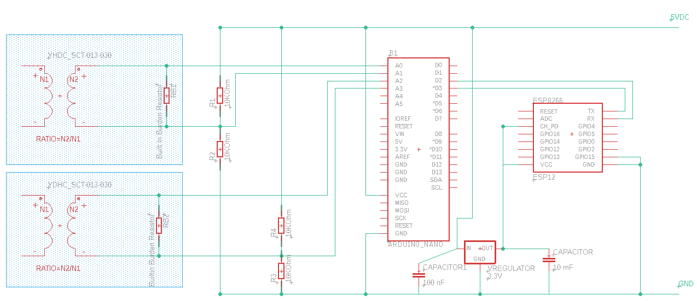

Machine meter
=============

This hardware & software solution is designated to watch and signal the end of washer and dryer programs.

The solution
------------

Long story short, when we moved to a bigger house, we’ve decided to put the washer and dryer machines in the cellar instead of the living area. As our current devices don’t have smart functionalities, I’ve decided to design and create a solution that can watch and signal the end of the programs to let my wife remove the cloths exactly when needed avoiding multiple unnecessary checks while the devices are still working.

In the cellar all required pipes and endpoints were available to install the machines.

While a machine is working, it’s consuming power that can be measured with a custom made appliance. The measured amount can be read, averaged and the value can be sent though WiFi to a database/service storing the measurements. We can define machine-specific thresholds indicating that the machine is working or already stopped, meaning the service can be programmed to determine the state of the machine and indicate it in human readable way. Even we can see the status on a mobile phone.

The solution consists of 3 hardware items with the required software components:

-   Metering device – custom made hardware device based on a measuring transformer, an Arduino Nano and an ESP8266 WiFi module
-   Central storage, database – Raspberry Pi 3 running a Python service and SQLite
-   Informational dashboard – custom made hardware device based on a 20x4 display, an Arduino Nano and an ESP8266 WiFi module

Measuring device and the washer:

Dryer machine:

Devices in the cellar:

Everybody can image a Raspberry Pi 3, so no photo taken.

Information dashboard device:

At the time when the photo was taken, the information dashboard was displaying (in Hungarian) that both the washer (mosogép) and the dryer (szárítógép) are working (megy) for 12 minutes.

Current measurement theory and basics
-------------------------------------

The following page describes the theory behind measuring current and gives detailed description on building of such measuring appliance:

<https://learn.openenergymonitor.org/electricity-monitoring/ct-sensors/introduction>

I’ve made several software and hardware tweaks to this solution, so I’ll briefly explain the main points of the theory and the practical stuff again highlighting the differences.

The idea is to use YHDC split core current transformer (CT). The original design has a 100 Amps primary side CT, however washers and driers consume at most 10 Amps so I’ve decided to use a smaller primary side CT which means that I can achieve more accurate measurement on the secondary side. The webshop I ordered stuff, had 30 Amps YHDC CT. The secondary side produces +-1 V alternating
voltage.

The analogue input of Arduino transforms input in range of 0-5 Volts to 0-1023. 2.5 V is 511. What we must do is to shift the +-1 Volts to 2.5V so that the analogue input will receive alternating voltage in the range 1.5 – 3.5. To achieve this, we must make a voltage divider.

As we measure alternating current which follows the shape of the sine wave the appropriate discrete current should be calculated via the RMS (Root Mean Square) method. The methodology is to read any number whole sine cycles (reading time should be multiple of 1/50 secs in case of 50 Hz AC) and execute the RMS method on the read values.

The original design reads only one analogue input and continuously refines the zero value. It means that we don’t know exactly the zero value (is it 511 or 512 or “511.5”) however the algorithm adds 1/1024 of the difference from the currently anticipated zero value.

I’ve changed this methodology in the following way:

1.  Not only the divergence from zero but the zero values are also read, meaning that the slightly moving zero value gives us more accurate results
2.  The midpoint of two neighboring measurements are used instead of the bare measurements

Based on my experience the correctness of the measurement is enhanced especially in case of the first 3 reads.

Measuring prototypes
--------------------

Following engineering best practices, before doing any complex solution a prototype should be made. For this I’ve used an Arduino UNO R3, some resistors, a YHDC current transformer as described on openenergymonitor.org.

An ESP8266 is also attached for WiFi connection.

One of the live (L) or neutral (N) wires (not both) should be passed through the transformer to measure current.

At this time a water boiler was used to validate the concept and the divergence from the zero was used while zero was continously averaged from the measurements.

The CurrentMeter project is uploaded to the Arduino.

Displaying the result is done on a 20x4 character display driven by an Arduino UNO R3:

ESP8266 is used for Wifi communication. InfoDashboard project is uploaded to the Arduino.

Before getting started with ESP8266 modules some of the commands in esp8266.txt should be considered for execution for stable communication.

Real life PoC
-------------

The measuring appliance under construction were tested with the washer and dryer. Real power consumption was measured.

As the next major step in the final construction, Arduino UNO was replaced with Arduino Nano, more precise wiring and soldering was used. I’ve decided to use a test panel instead of real PCB to be able to modify the construction as needed. With careful wiring it is rock solid.

Now we measure both divergence from zero, and zero.

The information dashboard was also finalized (at least I thought so) with an Arduino Nano, a potentiometer, solid wiring and soldering.

The service running on Raspberry Pi 3 (at that time Banana) displaying the following status messages.

Boxing the measuring appliance
------------------------------

The holes were cut for the sockets.

The sockets were installed together with the switches. The reason for the switches is that I wanted to have an easy way to power down the machines without plugging them out of the socket to maintain the lifetime of the plastic box.

I’ve prepared and glued the low-power measuring appliances to the bottom of the box. To be able to reliable transfer Wifi signal through reinforced concrete, an antenna has been installed and connected to the ESP8266 WiFi module.

The Live, Neutral and Ground wires have been installed accordingly for the 230V network (Hungary). Moreover the transformers were also added.

Basically 3 segments are installed in parallel:

-   Socket and switch for the washer
-   Socket and switch for the dryer
-   Input for the AC/DC adapter

A Live and a Neutral wire were connected to the AC/DC (-\>5V) adapter that powers the low-power devices.

The full construction looks like as follows:

Testing the current measurer device:

Required elements:

-   Plastic box with the right size
-   Blue, red, green+yellow wires
-   230V (in Hungary) supply elements
-   2 sockets
-   2 switches
-   1 AC/DC (-\>5V) adapter + appropriate socket
-   YHDC SCT-013-30-AX
-   2 10K (at least) Ohm resistors
-   Arduino Nano
-   ESP8266 (ESP-07)
-   Appropriate WiFi antenna
-   Test panel (630/200)
-   Wires (d=0.5mm)
-   CurrentMeter Arduino project

### Measuring part schematic

### 230V part schematic

Information dashboard device construction
-----------------------------------------

The information dashboard looked like an easier stuff, but at the end it turned out that it needed several changes from the original PoC.

We had a box, an appliance and a nasty-looking support for the display:

Putting all these together seemed to be fine:

Even after boxing the parts it was working in production for a week:

According to the original design the ESP8266 WiFi module got the 3.3V power from the Arduino. It turned out that the output 3.3 voltage of Arduino at the given load (we had an LCD with backlight) dropped to the 2.5V-2,8V range. Between these circumstances the WiFi module was able to start the network communication to the Raspberry Pi server, but was unable to finish it.

As the solution a 3.3V voltage regulator was installed:

Sometimes (measured by days or weeks) the display got noisy due to the many unreliable wire connections:

An I2C adapter was installed to reduce the number of wires:

Further resistors were installed to reduce the backlight of the display, moreover – not necessarily – capacitors were installed for the voltage regulators input and output.

While the hardware was evolving, several tweaks were applied to the InfoDashboard Arduino project, as well. As Arduino has only 2 KBs of memory and the String type was used to receive and process the response, some preallocations and more clever splits had to be used.

Required elements:

-   Suitable plastic box
-   AC/DC adapter (-\>5V)
-   Arduino Nano
-   ESP8266 WiFi module
-   20x4 character LCD display
-   [LCD-I2C-IF](https://www.hestore.hu/prod_10035516.html) – PCF8574 based LCD adapter
-   3.3V voltage regulator
-   100 nF and 10 mF capacitors
-   Wires
-   About 2K Ohm resistance for the LCD backlight
-   Support for the display

### Appliance schematic

REST service and database
-------------------------

The Raspberry Pi 3 part requires:

-   Python
-   Flask
-   Sqlite3
-   Gunicorn

The service is listening on port no 5000 and stores data in an Sqlite db.

To prepare the required python packages run preparepkg.sh, while the database can be initialized with the preparedb.py.

Gunicorn.service should be installed as a systemd service in production (app.py should be run for development).

The /webinfo endpoint is suitable for mobile browser based consumption.

